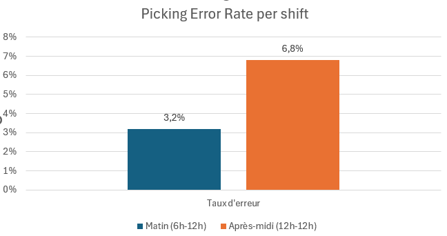
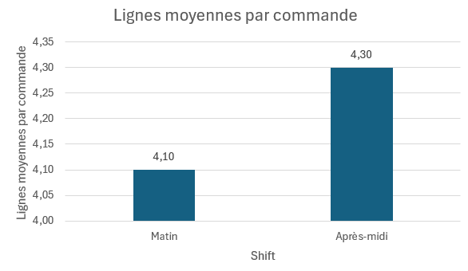
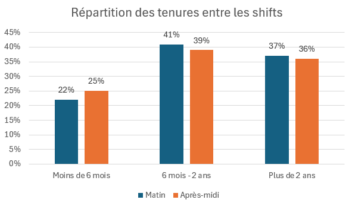

# A/B Testing — Impact d'une pause structurée sur le taux d'erreur de picking

**Secteur :** Logistique / Gestion d'entrepôt  
**Outils :** Python · Pandas · SciPy · Matplotlib  
**Compétences :** Design expérimental · Test statistique · Analyse exploratoire · Recommandation business

---

## Contexte

Une entreprise de logistique traite ~300 commandes par jour sur deux shifts. 
Après analyse de 3 mois de logs opérationnels, un écart significatif de taux 
d'erreur de picking est observé entre le shift matin et le shift après-midi.



Après élimination des explications alternatives (complexité des commandes, 
expérience des préparateurs), la cause probable identifiée est la fatigue 
accumulée sur le shift après-midi — qui enchaîne 4h30 de travail continu 
sans pause structurée.

|  |  |
|---|---|

---

## Objectif

Mesurer si l'introduction d'une pause obligatoire de 15 minutes à 16h00 
réduit significativement le taux d'erreur de picking.

- **H₀ :** la pause n'a aucun effet sur le taux d'erreur
- **H₁ :** la pause réduit le taux d'erreur de manière significative

---

## Design du test

Design croisé (crossover) sur 5 semaines — chaque équipe alterne 
entre les deux conditions semaine par semaine, ce qui élimine 
les biais liés aux différences structurelles entre équipes.

**Taille d'échantillon calculée en amont :** 3 113 commandes par condition  
**Seuil de décision business :** réduction minimale de 1.5 point de pourcentage

---

## Résultats

| Condition | Commandes | Erreurs | Taux d'erreur |
|---|---|---|---|
| Sans pause | 3 500 | 225 | 6.43% |
| Avec pause | 3 500 | 167 | 4.77% |
| **Différence** | | **−58 erreurs** | **−1.66 point** |

✅ **Statistiquement significatif** — p-value < 0.05 (test du chi²)  
✅ **Pratiquement significatif** — la différence dépasse le seuil business fixé

---

## Recommandation

**Déployer la pause obligatoire sur l'ensemble du shift après-midi.**

- ~4.6 erreurs évitées par jour
- ~1 155 erreurs évitées par an
- ~40 000 € d'économie annuelle estimée (base : 35€ par erreur)

---

## Structure du Repository
```
├── README.md
├── ab-testing-project.ipynb       ← Analyse complète avec code
├── Data/
│   └── picking_errors.csv
└── Visuals/
    └── PickingErrorRatePerShift.png
    └── AvgOrderLinesPerShift.png
    └── DistributionOfTenureAmongShifts.png
```

---

## Limites

- Coût par erreur estimé à 35€ — à valider avec le service finance
- Test sur 5 semaines — un suivi post-déploiement sur 3 mois est recommandé
- Effet Hawthorne possible — les préparateurs savaient participer à un test
